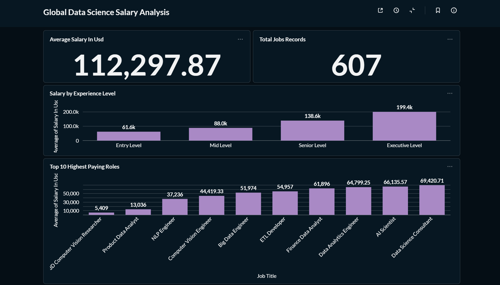
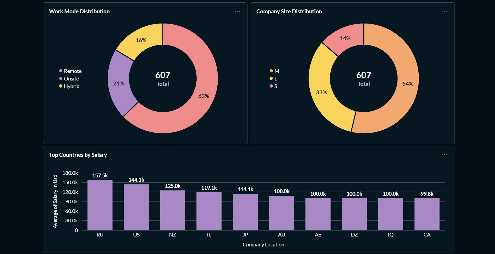

# Global Data Science Salary Analysis

## Project Overview

This project analyzes global data science salaries using Python, PostgreSQL, and Metabase. The objective is to explore salary trends, work arrangements, company characteristics, and experience levels within the data science industry.

The project demonstrates an end-to-end data anlytics workflow:

- Data Cleaning with Python (Pandas)
- Data Storage with PostgreSQL
- Daata Visualization with Metabase
- Business Insight Generation

---

## Dataset

Dataset: Data Science Salaries

Source:
https://www.kaggle.com/datasets/ruchi798/data-science-job-salaries

Dataset contains information about:
- Job Title
- Experience Level
- Employment Type
- Salary
- Remote Work Ratio
- Employee Residence
- Company Location
- Company Size

Total Records: 607

---

## Tech Stack

- Python
- Pandas
- PostgreSQL
- SQL
- Metabase
- GitHub

---

## Data Preparation

Data cleaning steps performed:

1. Removed unnecessary index column (`Unnamed: 0`)
2. Converted experience level codes:
   - EN → Entry Level
   - MI → Mid Level
   - SE → Senior Level
   - EX → Executive Level

3. Converted employment type codes:
   - FT → Full Time
   - PT → Part Time
   - CT → Contract
   - FL → Freelance

4. Created a new column (`work_mode`) from `remote_ratio`:
   - 0 → Onsite
   - 50 → Hybrid
   - 100 → Remote

---

## Database Design

Table Name: `jobs`

Main columns:

| Column | Description |
|----------|-------------|
| work_year | Year of work |
| experience_level | Experience category |
| employment_type | Employment type |
| job_title | Job position |
| salary_in_usd | Salary converted to USD |
| employee_residence | Employee country |
| company_location | Company country |
| company_size | Company size |
| work_mode | Onsite / Hybrid / Remote |

---

## Dashboard

### Global Data Science Salary Analysis




---

## Key Findings

### 1. Experience Significantly Impacts Salary

Executive-level professionals earn approximately **199K USD** annually, more than three times the average salary of entry-level professionals (**61K USD**).

### 2. Remote Work Dominates the Industry

Approximately **63%** of data science jobs in the dataset are fully remote, indicating widespread adoption of distributed work environments.

### 3. Medium-Sized Companies Lead Hiring

More than half of the job records belong to medium-sized companies, suggesting strong demand for data professionals among growing organizations.

### 4. Salary Varies Across Countries

Several countries show average salaries exceeding **140K USD**, reflecting differences in labor markets and demand for advanced data skills.

---

## Dashboard Components

The dashboard includes:

- Average Salary KPI
- Total Job Records KPI
- Salary by Experience Level
- Top Paying Job Roles
- Work Mode Distribution
- Company Size Distribution
- Top Countries by Average Salary

---

## Project Structure

```text
global-data-science-salary-analysis/
│
├── data/
│   └── data_science_jobs_clean.csv
│
├── notebooks/
│   └── salary_analysis.ipynb
│
├── sql/
│   └── create_table.sql
│
├── images/
│   └── Dashboard1.png
│
└── README.md
```

---

## Author

Abiyu Raihan Hanif

